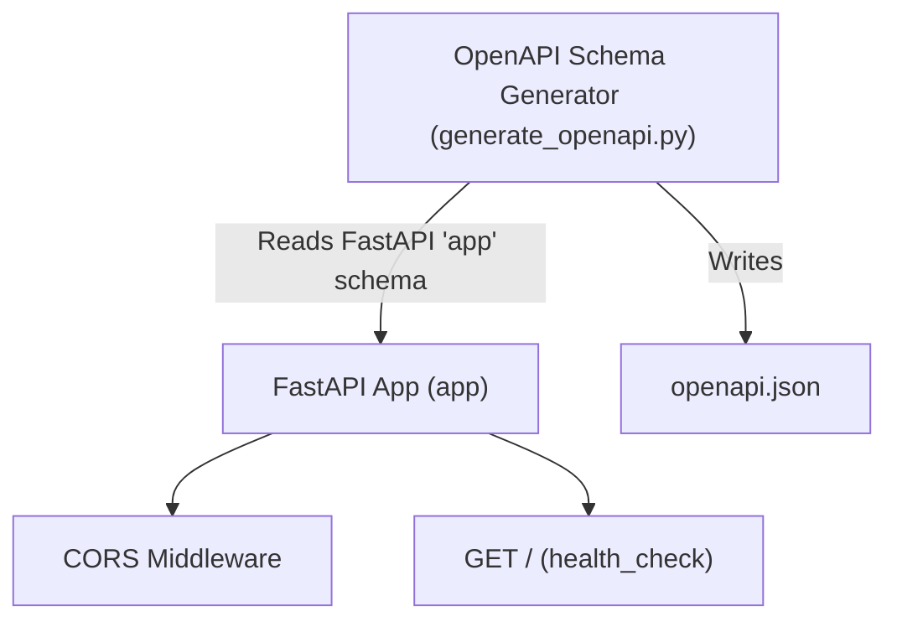

# Backend API Architecture

This document describes the architecture of the `backend_api` service for the Automated Selenium Script Generator project.

## Overview

The backend service is implemented using FastAPI and is responsible for providing an API to generate Selenium Python scripts (as per planned requirements). The current codebase contains basic project scaffolding, including health-check endpoints, CORS middleware, and the routine to export the OpenAPI specification.

### Components

- **FastAPI Application (`src/api/main.py`):**  
  Initializes the FastAPI app, attaches CORS middleware to allow cross-origin requests, and defines a basic health-check endpoint (`GET /`).

- **OpenAPI Schema Generation (`src/api/generate_openapi.py`):**  
  This script extracts the OpenAPI schema from the FastAPI application and writes it into a JSON file at `interfaces/openapi.json`. This is useful for documentation and for frontend or integration consumers.

- **CORS Middleware:**  
  The app is configured to accept requests from any origin with any methods or headers, supporting broad integration in web and automation contexts.

### Directory Structure
- `src/api/main.py`: Application root, endpoint definitions, middleware.
- `src/api/generate_openapi.py`: OpenAPI schema writer utility.
- `interfaces/openapi.json`: JSON representation of the OpenAPI schema as generated.

## Mermaid Architecture Diagram

## Notes and Future Extension

As of this version, the backend does not yet implement endpoints or logic to handle Selenium Python script generation. These capabilities are anticipated per project requirements and will exist as additional endpoints and internal logic in future iterations.

---

_Last updated: [INSERT DATE HERE]_

